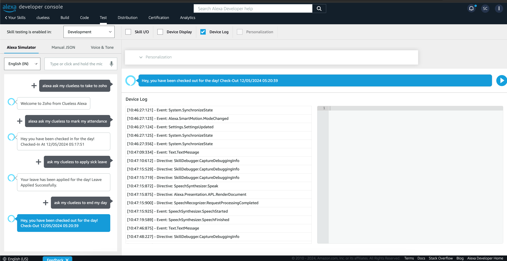
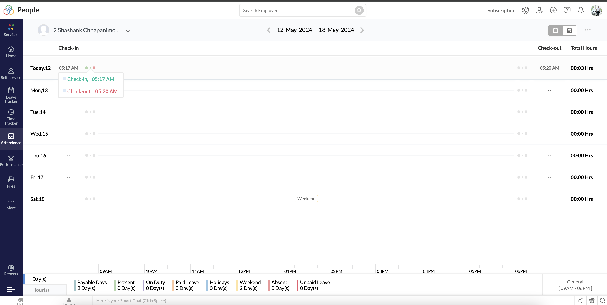
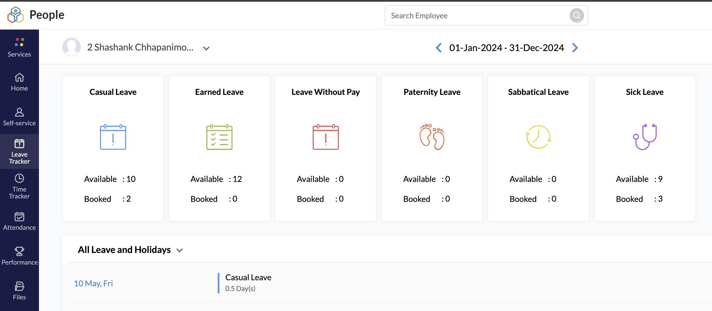

  
   
  <h1 align="center">"Clueless" - HRMS Voice Assistant powered by Alexa</h1>
  
Clueless, the HRMS Voice Assistant makes it easier for you to mark your attendance to ZohoPeople portal i.e. Check-In, Check-Out, Apply Leave,etc.

# Clueless
A simple [AWS Lambda](http://aws.amazon.com/lambda) function that contains the logic of handling the HRMS day-to-day requests for the Amazon Echo using the Alexa SDK via a configured Alexa Skill named `clueless`.

## Concept
We have a request handlers for each of the requests like CheckIn, CheckOut, Apply Leave, in the ZOHO Portal. We have in placed a AWS lambda named `cluelessAlexa` which is linked to a Alexa Skill, `clueless` which can be invoked by `my clueless`.

Example:

**Alexa, ask my clueless to take me to zoho**
   
**Alexa, ask my clueless to mark my attendance**

## Testing the clueless skill

### Results in Zoho

### AWS Lambda Setup
Refer to [Hosting a Custom Skill as an AWS Lambda Function](https://developer.amazon.com/docs/custom-skills/host-a-custom-skill-as-an-aws-lambda-function.html) reference for a walkthrough on creating a AWS Lambda function with the correct role for your skill. When creating the function, select the “Author from scratch” option, and select the Java 8 runtime.

To build the sample, open a terminal and go to the directory containing pom.xml, and run 'mvn org.apache.maven.plugins:maven-assembly-plugin:2.6:assembly -DdescriptorId=jar-with-dependencies package'. This will generate a zip file named "helloworld-1.0-jar-with-dependencies.jar" in the target directory.

Once you've created your AWS Lambda function and configured “Alexa Skills Kit” as a trigger, upload the JAR file produced in the previous step and set the handler to the fully qualified class name of your handler function. Finally, copy the ARN for your AWS Lambda function because you’ll need it when configuring your skill in the Amazon Developer console.

### Alexa Skill Setup
Please refer to [Developing Your First Skill](https://developer.amazon.com/docs/alexa-skills-kit-sdk-for-java/develop-your-first-skill.html) for detailed instructions.

## Designed and Developed by
**Shashank & Shashank**